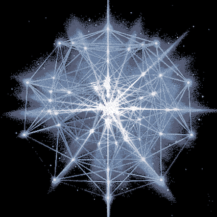

 
### Decentralization and Distributed Systems

---

### Decentralization and Distributed Systems

---
 
### Decentralization and Distributed Systems

---

### Decentralization and Distributed Systems

What is distributed contexting? Distributed contexting is about distributed systems and contexting. Surprisingly, Contexting is hard to explain without its context which is actually distributed systems. I will start with distributed systems and come to contexting in a minute, so to speak.

---?include=why/PITCHME.md

---?include=how/PITCHME.md

---?include=what/PITCHME.md

---?include=epilog/PITCHME.md

