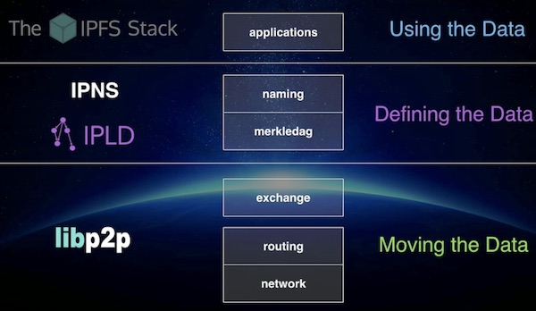
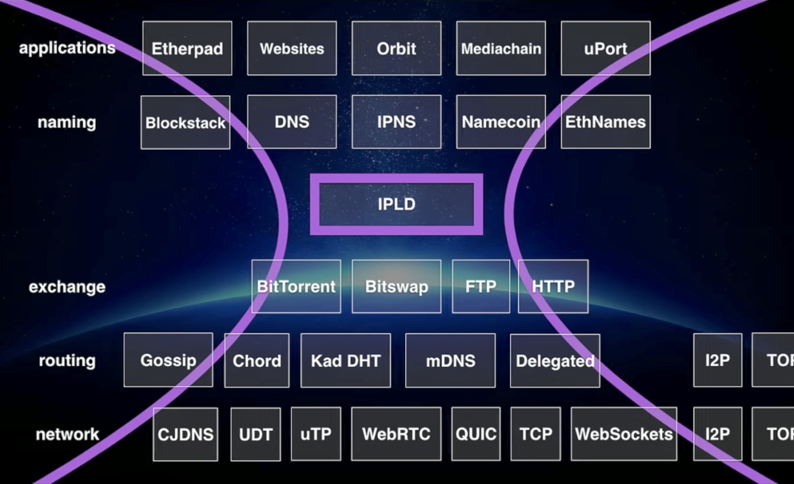

### 101 IPFS Workshop


---

### Introduction

- Open concepts
- IPFS, ProtoSchool

---



---



---

### Installation

- IPFS

---

### Exploration

- ```ipfs``` command
- ```ipfs daemon```
- WebUI
- Gateways

---

### Discussion

- Impressions
- Problems and questions
- Ideas and issues

---

### Panel

- What's next?

---?include=epilog/PITCHME.md