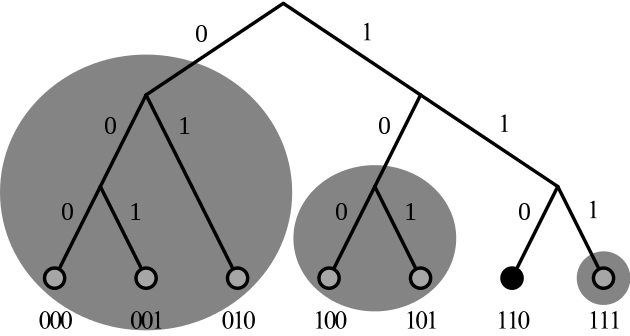

### 101 IPFS Workshop


---

### Introduction

- Concepts
- IPFS, ProtoSchool

---

<h3 align="center"> Creative Learning </h3>


---

<h3 align="center"> Distributed Hash Table </h3>


---

<h3 align="center"> Merkle Tree </h3>


---

<h3 align="center"> Blockchain </h3>


---

<h3 align="center"> XOR-Metrics, e.g. Kademlia </h3>



---


---


---

**Interactive tutorials for Golang** is a missing feature in my opinion.

I am used to giving talks about Go using its tool ```present``` to edit and run the code inside the presentation.

- [package present](https://godoc.org/golang.org/x/tools/present) How to create the presentation
- [Command present](https://godoc.org/golang.org/x/tools/cmd/present) Start presentation on localhost or an App Engine instance

I have the slides of my presentations in my repo [go-present](https://github.com/stefanhans/go-present), and it is published on go-talks.appspot.com/github.com/user/repo/path automatically.

If I need packages like go-libp2p, not included online, I have to do the presentation on localhost. There's as well the possibility to run ```present``` in the cloud, e.g., GCP App Engine. I've never tried it, but it seems manageable.

In any case, to have interactive tutorials showing how to use Go in combination with IPFS, libp2p, etc. would make ProtoSchool at least for Go developers more attractive.

---

### Installation

- IPFS

---

### Exploration

- ```ipfs``` command
- ```ipfs daemon```
- WebUI
- Gateways

---

### Discussion

- Impressions
- Problems and questions
- Ideas and issues

---

### Panel

- What's next?
